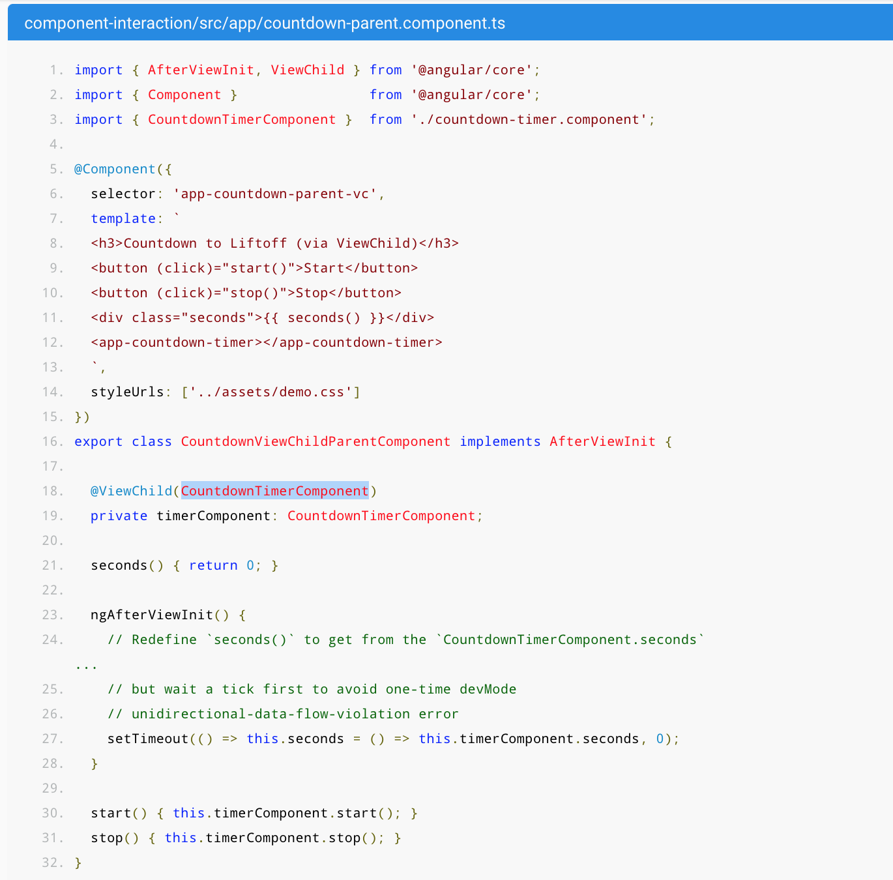

1. Two way property binding -  <input [(ngModel)]="selectedHero.name" placeholder="name"></label>
   This says that selectedHero.name in the ts file will be update if it changes in the template and vice versa. 
   This is how we acheive two way property binding.

2. One way binding is achieved through interpolation - {{}}

3. For a parent child component relationship of property binding we use this template in parent html:


#####Parent Template
``` 
<h2>My Heroes</h2>
<ul class="heroes">
  <li *ngFor="let hero of heroes"
    [class.selected]="hero === selectedHero"
    (click)="onSelect(hero)">
    <span class="badge">{{hero.id}}</span> {{hero.name}}
  </li>
</ul>

<app-hero-detail [hero]="selectedHero"></app-hero-detail>
```

#####Child Template
```
<div *ngIf="hero">

  <h2>{{hero.name | uppercase}} Details</h2>
  <div><span>id: </span>{{hero.id}}</div>
  <div>
    <label>name:
      <input [(ngModel)]="hero.name" placeholder="name"/>
    </label>
  </div>
</div>
```

--> So in parent I am calling child with this tag: <app-hero-detail [hero]="selectedHero"></app-hero-detail>
which says that 'selectedHero' property of the parent needs to be linked to [hero] property of child.
and in child's ts component we will use @Input decorator for the [hero] property to say that  child component is ready to 
receive the property via a @Input decorator.

<b>REFERENCE:</b> src/app/subu/subu.component.html for one-way, two-way binding and interpolation.
https://appdividend.com/2018/01/28/angular-input-output-tutorial-example-scratch/

##### BINDING
1. Template expressions: ```Delete hero</button> 
<button (click)="onSave($event)">Save</button>
<button *ngFor="let hero of heroes" (click)="deleteHero(hero)">{{hero.name}}</button>
<form #heroForm (ngSubmit)="onSubmit(heroForm)"> ... </form>
```
$event will say whether it is MouseEvent or Keyboard Event etc.

3. There are 3 tyoes of binding
    a. One way from data source to view target: Except interpolation, we have a target name to the left of the = sign.
    egs: 
    ```
    {{expression}}
    [target]="expression"
    bind-target="expression"
    ```
    
    b. One way from view to data source. eg:
    ```
    (target)="statement"
    ```
    
    c. Two way binding: view -> source -> view
    ``` 
    [(target)]="expression"
    ```
    
Angular offers a special two-way data binding syntax for this purpose, [(x)]. The [(x)] syntax combines the brackets of property binding,
 [x], with the parentheses of event binding, (x).
 
Note: Property and attribute values are different. eg: ``` <button disabled="false">Still Disabled</button>.``` changes the attribute disabled to false,
but that doesnt make the button disabled. It will be disabled with ```<button [disabled]="isUnchanged">Save</button> ``` [disabled] here is the angular property.

    
4. You bind two components by using the component binding, view to compoenent binding using proeprty binding.

5. Class Binding : Example of class binding is : ``` <div class="bad curly special"[class]="badCurly">Bad curly</div>```

6. Style Binding: ``` <button [style.background-color]="canSave ? 'cyan': 'grey'" >Save</button> ```

7. @Input and @Output Decortors: An Input property is a settable property annotated with an @Input decorator. Values flow into the property
 when it is data bound with a property binding.
An Output property is an observable property annotated with an @Output decorator. The property almost always returns an Angular 
EventEmitter. Values flow out of the component as events bound with an event binding.
## Example: within same component and template level we dont need output and Input decorators
```<label>
  <input [ngModel]="name" (ngModelChange)="setUppercase($event)">
</label>
```

```
  //@Input() -- input decorator not required
  name: string;

// @Output() -- output decorator not required
  setUppercase(event: Event) {
    this.name = 'hjjjjhgh';
  }

``` 
OR alternatively within two components we need the decorators.
``` 
@Input()  hero: Hero;
@Output() deleteRequest = new EventEmitter<Hero>()>;

<app-hero-detail [hero]="currentHero" (deleteRequest)="deleteHero($event)">
</app-hero-detail>

```
deleteHero() and currentHero are part of the parent component.

8. @VIEWCHILD : Parent accessing childs components made easy



#### ROUTING

1. Add following in the app-routing.module.ts
    const routes: Routes = [
      { path: 'heroes', component: HeroesComponent }
    ];
    
2. In app.component.html, add
    ```
    <h1>{{title}}</h1>
    <router-outlet></router-outlet>
    <app-messages></app-messages>  // If we want this component to be shown after the routing, then remove this
    ```
3. In app.component.html add
   <nav>
     <a routerLink="/heroes">Heroes</a>
   </nav>


## MODULES
Modules are collection of Components, Services etc to make a unit

## DIRECTIVES
Components are directives. 2 other types of directives are: Structural and Attributes Directives
1. Structural: They alter the layout by adding, removing and replacing elements in DOM eg: ngFor and ngIf.
2. Attribute : They alter the appeerance or behaviour of the existing elements. eg: ngModel.

example of an event driven directive
```
import { Directive, ElementRef, HostListener } from '@angular/core';
 
@Directive({
  selector: '[appHighlight]'
})
export class HighlightDirective {
  constructor(private el: ElementRef) { }
 
  @HostListener('mouseenter') onMouseEnter() {
    this.highlight('yellow');
  }
 
  @HostListener('mouseleave') onMouseLeave() {
    this.highlight(null);
  }
 
  private highlight(color: string) {
    this.el.nativeElement.style.backgroundColor = color;
  }
}


and in the template it wuld be
<p appHighlight>Highlight me!</p>

```
Pass values into the directive with an @Input data binding
1. One way is:
  a. In component ``` @Input() highlightColor: string;```.
  b. In template ```<p appHighlight highlightColor="yellow">Highlighted in yellow</p> ```
  
2. Second way is simultaneously apply the directive and set the color in the same attribute like this
  a. In component ``` @Input() highlightColor: string;```.
  b. In Template ``` <p [appHighlight]="color">Highlight me!</p> ```


